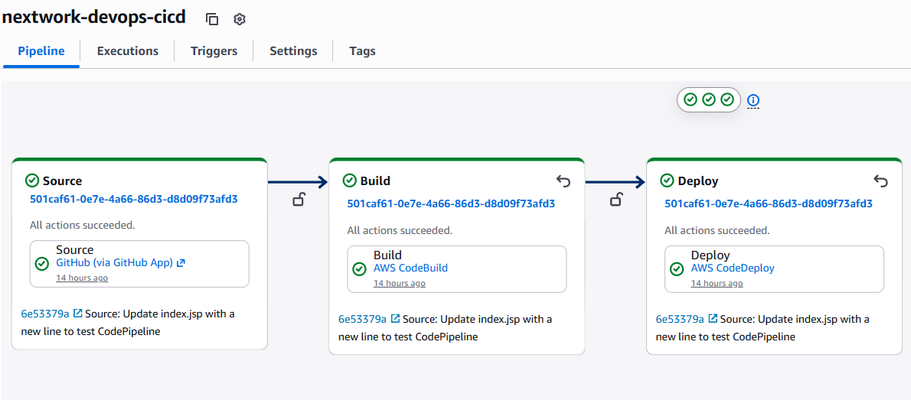
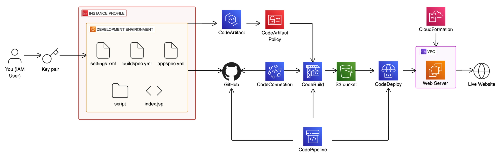
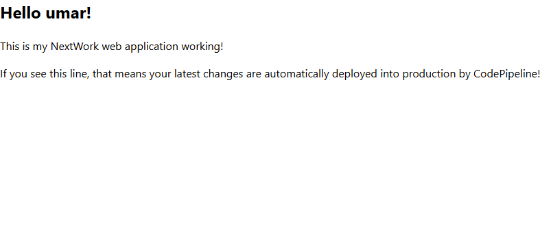

# AWS CI/CD Pipeline

A hands-on DevOps project which demonstrates a complete CI/CD pipeline for deploying a Java web application using AWS.

The pipeline automates the process from source code to deployment on an EC2 instance.

## Pipeline



## How It Works

1. Source code is stored in GitHub.
2. AWS CodePipeline manages the CI/CD workflow.
3. AWS CodeBuild builds the Java application using Maven.
4. Dependencies are accessed through AWS CodeArtifact.
5. Build artifacts are stored in Amazon S3.
6. AWS CodeDeploy deploys the application to an EC2 instance.
7. The application is served from the EC2 deployment environment.

## AWS Services Used

* **CodePipeline** – Orchestrates the CI/CD workflow.
* **CodeBuild** – Builds and packages the Java application.
* **CodeDeploy** – Deploys the application to EC2.
* **EC2** – Hosts the deployed application.
* **S3** – Stores build and deployment artifacts.
* **CodeArtifact** – Provides Maven package repository access.
* **IAM** – Manages permissions between AWS services.
* **CloudFormation** – Provisions the deployment infrastructure.

## Key Files

```text
├── pom.xml                 # Maven project configuration
├── buildspec.yml           # CodeBuild instructions
├── appspec.yml             # CodeDeploy configuration
├── settings.xml            # Maven/CodeArtifact configuration
└── scripts/                # Deployment scripts
```

## Complete Architecture


*Architecture diagram from the [NextWork CI/CD Pipeline project](https://nextwork.ai/projects/aws-devops-codepipeline-updated), used as a reference for this build.*

## What I Learned

This project gave me practical experience with:

* Building a CI/CD pipeline on AWS
* Infrastructure as Code with CloudFormation
* AWS IAM roles and permissions
* Maven and Java application builds
* CodeDeploy lifecycle hooks
* EC2 deployment environments
* Troubleshooting cloud infrastructure and deployment issues

## Issues I Ran Into

* **EC2 crashing during deployment** — Started with a t2.micro instance, but the server kept crashing while downloading packages. t2.micro only has 1GB of RAM, and it couldn't handle the scale of this project. Switched to t2.small (2GB RAM) in the CloudFormation template, which resolved the crashes and let deployments complete reliably.

## Future Improvements

* Add automated tests to the build stage
* Add deployment health checks
* Add CloudWatch monitoring
* Containerise the application with Docker

## Final Deployment

